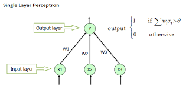

## Perceptron

The single-layer perceptron gives us a helpful foothold for the class of algorithms known as artificial neural networks.

The single-layer perceptron takes a set of input values (x) which are multiplied by a set of weights (w) and fed into a simple function to produce a binary (True or False) output.

{: width="600px"}

In this figure, a perceptron is shown responding to a set of photocells forming the letter X. With labelled examples of the letter, the algorithm could learn to recognise this pattern in unseen data.

At the core of the perceptron is an activation function. Modelled on a neuron, the function takes the inputs multiplied by weights and produces a binary output. 

The function is simple: if the sum of the inputs is above a defined threshold then output 1 (True), otherwise output 0 (False).

$$
ADD THRESHOLD FUNCTION
$$

{: width="600px"}

{: width="600px"}


Given a set of weights, the output of the algorithm is therefore given by:

$$
ADD FULL FUNCTION
$$

How do we learn which weights give us the best fitted model for our classification task?

## Learning algorithm

The perceptron can be trained to learn weights that allows it to discriminate between two classes, using the following process:

1. Initialize the weights. Weights may be initialized to 0 or to a small random value. 
2. For each example j in our training set D, perform the following steps over the input 
    1. Calculate the actual output
    2. Update the weights

## Predicting outcome

The scikit-learn package includes a Perceptron model. Let's use this model to predict the outcome of patients admitted to critical care units. 

To keep things simple, we will limit ourselves to only two predictors: heart rate and mean blood pressure.

```python
import pandas as pd
import sqlite3
import matplotlib.pyplot as plt

# prepare query
query = """
SELECT a.apachescore, a.actualhospitalmortality, v.apachescore
FROM apachepatientresult a
ON p.patientunitstayid = a.patientunitstayid
INNER JOIN apacheapsvar v
ON p.patientunitstayid = v.patientunitstayid
WHERE a.apacheversion LIKE 'IVa'
"""

# Read sqlite query results into a pandas DataFrame
con = sqlite3.connect("data/eicu_v2_0_1.sqlite3")
cohort = pd.read_sql_query(query, con)
con.close()

cohort.head()
colors = {"ALIVE": "blue", "EXPIRED": "red"}
cohort.plot(kind="scatter", x="apachescore", y="apachescore",
            c=cohort['actualhospitalmortality'].map(colors))
plt.show()
```

Fit the model to our data:

```python
from sklearn.linear_model import Perceptron
clf = Perceptron(tol=1e-3, random_state=0)
clf.fit(X, y)

# NOW PLOT THE DECISION BOUNDARY
plt
```

Let's try building the model ourselves. Our activation function can be coded as:

```python
class Perceptron():
    """
    Perceptron
    """
    def activation(self, x):
        return 1 if x > 0 else 0
```

We need to set some hyperparameters. The number of epochs and the learning rate.

```python
class Perceptron():
    """
    Perceptron
    """
    def __init__(self, learning_rate=0.1, epochs=20):
        # hyperparams
        self.learning_rate = learning_rate
        self.epochs = epochs

    def activation(self, x):
        return 1 if x > 0 else 0
```

Each of our input variables will be multiplied by a weight, so we will need to find
optimal values for these weights.

To incorporate bias, we include an additional weight of 1, and the bias is treated as
an additional input. Let's put all this into our Perceptron:

We'll initialise our model parameters. We'll start with everything as 0.

Note we need to rescale if not on same scale.

```python
df[5] = np.where(df[4].values == 'Iris-setosa', 1, 0)

class Perceptron2():
    """
    Perceptron
    """
    def __init__(self, learning_rate=0.01, epochs=20):
        # hyperparams
        self.learning_rate = learning_rate
        self.epochs = epochs

    def input_function(self, xs):
        """
        Dot product of features and weights + bias
        """
        return xs @ self.weights + self.bias

    def activation_function(self, x):
        """
        Step function
        """
        return 1 if x > 0 else 0

    def error_function(self, y, y_hat):
        """
        Compute difference between prediction and outcome.
        """
        return y - y_hat

    def update_params(self, error, xs):
        """
        update model parameters (weight and bias)
        """
        # nudge the parameters in the direction of the error class
        self.bias = self.bias + (self.learning_rate * error * 1)
        self.weights = self.weights + (self.learning_rate * error * xs)

    def train(self, features, outcomes):
        """
        Train the model.
        """
        # step 1: initialise bias and weights
        self.bias = 0
        self.weights = np.zeros(np.shape(features)[1])

        self.losses = []
        for i in range(self.epochs):
            loss = 0
            # 2. For each example xs in our training set
            for xs, y in zip(features, outcomes):
                # calculate input
                inputs = self.input_function(xs)
                # calculate the output
                prediction = self.activation_function(inputs)
                # compute error
                error = self.error_function(y, prediction)
                # update model. 
                # "online learning". updates done per data point.
                self.update_params(error, xs)
                # count misses
                if error:
                    loss = loss + 1

            self.losses.append(loss)
```

We can train the model:

```python
ppn = Perceptron(epochs=10, eta=0.1)

ppn.train(X, y)
print('Weights: %s' % ppn.w_)
```

We can plot the decision boundary:

```python
plt.plot(range(1, len(ppn.errors_)+1), ppn.errors_, marker='o')
plt.xlabel('Iterations')
plt.ylabel('Misclassifications')
plt.show()
```

We can plot the misclassifications over each iteration. 

```python
plt.plot(range(1, len(ppn.errors_)+1), ppn.errors_, marker='o')
plt.xlabel('Iterations')
plt.ylabel('Misclassifications')
plt.show()
```

The perceptron is limited. Only able to converge if classes can be separated by
a linear plane. Later models such as ADALINE (Adaptive Linear Neuron) were introduced in the 1960s
that replaces the step fnction with a continuous linear function.

The addition of a linear function allows us to use gradient descent to optimise our model.
Similar to linear regression visited previously, we can define error as squared error.




